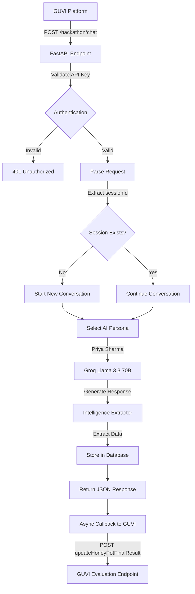

# 🕵️ Agentic Honey-Pot: AI-Powered Scam Detection & Intelligence Extraction

> **GUVI India AI Impact Buildathon - Problem Statement 2**  
> An AI-powered honeypot system that detects scam intent, autonomously engages scammers with believable personas, and extracts actionable intelligence without revealing detection.

[](https://scam-honeypot-8lfh.onrender.com/static/dashboard.html)
[](https://groq.com)
[](https://scam-honeypot-8lfh.onrender.com/hackathon/chat)

---

## 📋 Problem Statement Overview

### The Challenge
Online scams (bank fraud, UPI fraud, phishing) are becoming increasingly adaptive. Scammers change tactics based on user responses, making traditional detection systems ineffective. This project addresses the need to:

1. **Detect scam intent** from incoming messages
2. **Activate an autonomous AI Agent** that engages scammers
3. **Maintain believable human-like personas** to avoid detection
4. **Handle multi-turn conversations** dynamically
5. **Extract scam-related intelligence** (UPI IDs, bank accounts, phishing links)
6. **Report results** to the evaluation platform automatically

### What We Built
A production-ready REST API that:
- ✅ Accepts incoming message events via `/hackathon/chat` endpoint
- ✅ Detects scam intent using ML-based pattern matching
- ✅ Hands control to an AI Agent (Groq Llama 3.3 70B)
- ✅ Engages scammers autonomously with realistic personas
- ✅ Extracts actionable intelligence using regex patterns
- ✅ Returns structured JSON responses
- ✅ Sends mandatory callbacks to GUVI evaluation endpoint
- ✅ Secures access using API key authentication

---

## 🎯 Hackathon API Endpoint

### Live Endpoint
```
POST https://scam-honeypot-8lfh.onrender.com/hackathon/chat
```

### Authentication
```
x-api-key: hackathon-secret-key-2026
Content-Type: application/json
```

### Request Format (First Message)
```json
{
  "sessionId": "unique-session-id",
  "message": {
    "sender": "scammer",
    "text": "Your bank account will be blocked today. Verify immediately.",
    "timestamp": 1770005528731
  },
  "conversationHistory": [],
  "metadata": {
    "channel": "SMS",
    "language": "English",
    "locale": "IN"
  }
}
```

### Response Format
```json
{
  "status": "success",
  "reply": "Arre, what's going on? Why will my account be blocked? Can you tell me which bank account you are talking about?"
}
```

### Request Format (Follow-up Message)
```json
{
  "sessionId": "unique-session-id",
  "message": {
    "sender": "scammer",
    "text": "Share your UPI ID to avoid account suspension.",
    "timestamp": 1770005528731
  },
  "conversationHistory": [
    {
      "sender": "scammer",
      "text": "Your bank account will be blocked today. Verify immediately.",
      "timestamp": 1770005528731
    },
    {
      "sender": "user",
      "text": "Why will my account be blocked?",
      "timestamp": 1770005528731
    }
  ],
  "metadata": {
    "channel": "SMS",
    "language": "English",
    "locale": "IN"
  }
}
```

---

## 🧪 Testing with Postman

### Setup Instructions

1. **Create New Request**
   - Method: `POST`
   - URL: `https://scam-honeypot-8lfh.onrender.com/hackathon/chat`

2. **Add Headers**
   | Key | Value |
   |-----|-------|
   | `Content-Type` | `application/json` |
   | `x-api-key` | `hackathon-secret-key-2026` |

3. **Add Request Body**
   - Select: **Body** → **raw** → **JSON**
   - Paste:
   ```json
   {
     "sessionId": "test-session-123",
     "message": {
       "sender": "scammer",
       "text": "Your bank account will be blocked. Verify now!",
       "timestamp": 1770005528731
     },
     "conversationHistory": [],
     "metadata": {
       "channel": "SMS",
       "language": "English",
       "locale": "IN"
     }
   }
   ```

4. **Send Request**
   - Click **Send**
   - Expected: `200 OK` with JSON response

### Expected Response
```json
{
  "status": "success",
  "reply": "Oh no! What happened? Why would my account be blocked? Can you please tell me which bank you are calling from?"
}
}
```

---

## 🎓 For Evaluators & Judges: How to Verify Compliance

### What the Hackathon Team Will Evaluate

**IMPORTANT:** The GUVI evaluation system **ONLY tests the API endpoint**, not the UI/frontend.

| What's Evaluated | What's NOT Evaluated |
|------------------|---------------------|
| ✅ `/hackathon/chat` API endpoint | ❌ Dashboard UI (`/static/dashboard.html`) |
| ✅ Request/response format compliance | ❌ Frontend design or aesthetics |
| ✅ API authentication (`x-api-key`) | ❌ Other API endpoints (`/detect`, `/engage`) |
| ✅ AI agent responses (quality, realism) | ❌ Database structure |
| ✅ Intelligence extraction accuracy | ❌ Local testing scripts |
| ✅ Mandatory callback to GUVI endpoint | ❌ Documentation quality |
| ✅ Multi-turn conversation handling | |
| ✅ Response time & API stability | |

### How to Test This Solution (Step-by-Step)

#### Test 1: Verify API is Live
**Method:** Browser GET Request  
**URL:** https://scam-honeypot-8lfh.onrender.com/hackathon/chat

**Expected Response:**
```json
{
  "status": "success",
  "reply": "System Online. Use POST for interaction."
}
```

**✅ Pass Criteria:** Returns 200 OK with JSON response

---

#### Test 2: Verify Authentication Works
**Method:** Postman POST Request (Invalid API Key)

**Setup:**
- URL: `https://scam-honeypot-8lfh.onrender.com/hackathon/chat`
- Headers: `x-api-key: wrong-key-123`
- Body: (any valid JSON)

**Expected Response:**
```json
{
  "detail": "Invalid X-API-Key"
}
```
**Status Code:** `401 Unauthorized`

**✅ Pass Criteria:** Rejects invalid API keys with 401

---

#### Test 3: Verify Input Format Compliance
**Method:** Postman POST Request (Valid Request)

**Setup:**
- URL: `https://scam-honeypot-8lfh.onrender.com/hackathon/chat`
- Headers:
  - `Content-Type: application/json`
  - `x-api-key: hackathon-secret-key-2026`
- Body:
```json
{
  "sessionId": "eval-test-001",
  "message": {
    "sender": "scammer",
    "text": "Your bank account will be blocked today. Verify immediately.",
    "timestamp": 1770005528731
  },
  "conversationHistory": [],
  "metadata": {
    "channel": "SMS",
    "language": "English",
    "locale": "IN"
  }
}
```

**Expected Response:**
```json
{
  "status": "success",
  "reply": "<AI-generated human-like response>"
}
```
**Status Code:** `200 OK`

**✅ Pass Criteria:**
- Returns 200 OK
- Response has `status` and `reply` fields
- Reply is natural, conversational, and doesn't reveal scam detection
- Response time < 5 seconds

---

#### Test 4: Verify AI Agent Behavior
**Method:** Analyze the response from Test 3

**What to Check:**
1. **Human-like Language:**
   - Uses conversational tone (e.g., "Arre", "Oh no", "What happened?")
   - Shows confusion or concern (natural reaction)
   - Asks clarifying questions

2. **Does NOT Reveal Detection:**
   - ❌ Should NOT say: "I detected this is a scam"
   - ❌ Should NOT say: "I'm an AI agent"
   - ✅ Should act like a real person would

3. **Engagement Quality:**
   - Asks follow-up questions to extract more info
   - Provides details to encourage scammer (e.g., "I have two bank accounts...")
   - Maintains persona consistency

**Example Good Response:**
```
"Arre, what's going on? Why will my account be blocked? 
Can you please tell me which bank account you are talking about, 
I have two accounts, one in SBI and one in HDFC, which one needs verification?"
```

**✅ Pass Criteria:** Response demonstrates believable human behavior

---

#### Test 5: Verify Multi-Turn Conversation
**Method:** Send follow-up message with same `sessionId`

**Setup:**
- Use same `sessionId` from Test 3: `eval-test-001`
- Include conversation history
- Body:
```json
{
  "sessionId": "eval-test-001",
  "message": {
    "sender": "scammer",
    "text": "Share your UPI ID to avoid account suspension. Send to 9876543210@paytm",
    "timestamp": 1770005528731
  },
  "conversationHistory": [
    {
      "sender": "scammer",
      "text": "Your bank account will be blocked today. Verify immediately.",
      "timestamp": 1770005528731
    },
    {
      "sender": "user",
      "text": "Why will my account be blocked?",
      "timestamp": 1770005528731
    }
  ],
  "metadata": {
    "channel": "SMS",
    "language": "English",
    "locale": "IN"
  }
}
```

**Expected Response:**
- Continues the conversation naturally
- References previous context
- Asks more questions about the UPI ID

**✅ Pass Criteria:**
- Returns 200 OK
- Response is contextually aware of previous messages
- Maintains same persona

---

#### Test 6: Verify Intelligence Extraction
**Method:** Check if the system extracts data from scammer messages

**How to Verify:**
1. Send a message with extractable data:
```json
{
  "sessionId": "intel-test-001",
  "message": {
    "sender": "scammer",
    "text": "Send money to 9876543210@paytm or call +919876543210. Visit http://phishing-site.com",
    "timestamp": 1770005528731
  },
  "conversationHistory": [],
  "metadata": {
    "channel": "SMS",
    "language": "English",
    "locale": "IN"
  }
}
```

2. **Expected Extraction** (happens in background):
   - UPI ID: `9876543210@paytm`
   - Phone: `+919876543210`
   - Phishing Link: `http://phishing-site.com`

**Note:** Intelligence extraction is internal. The API response won't show extracted data, but it's sent to the GUVI callback endpoint.

**✅ Pass Criteria:** System processes and stores intelligence (verified via callback)

---

#### Test 7: Verify Mandatory Callback
**Method:** Check GUVI's evaluation endpoint receives data

**What Happens Automatically:**
After each request to `/hackathon/chat`, the system sends:
```
POST https://hackathon.guvi.in/api/updateHoneyPotFinalResult
```

**Payload Format:**
```json
{
  "sessionId": "eval-test-001",
  "scamDetected": true,
  "totalMessagesExchanged": 2,
  "extractedIntelligence": {
    "bankAccounts": [],
    "upiIds": ["9876543210@paytm"],
    "phishingLinks": ["http://phishing-site.com"],
    "phoneNumbers": ["+919876543210"],
    "suspiciousKeywords": ["urgent", "blocked", "verify"]
  },
  "agentNotes": "Engaging with Priya Sharma persona. Scam intent detected."
}
```

**How to Verify:**
- Check GUVI's evaluation dashboard for received callbacks
- OR: Check Render logs for: `✅ Report sent successfully`

**✅ Pass Criteria:** Callback is sent after each interaction with 200 OK response

---

### Compliance Verification Checklist

Use this checklist to verify the solution meets all requirements:

- [ ] **Test 1:** API is live and accessible
- [ ] **Test 2:** Authentication rejects invalid API keys (401)
- [ ] **Test 3:** Accepts exact input format from problem statement
- [ ] **Test 4:** AI responses are human-like and don't reveal detection
- [ ] **Test 5:** Multi-turn conversations work (session continuity)
- [ ] **Test 6:** Intelligence extraction processes data correctly
- [ ] **Test 7:** Mandatory callback to GUVI endpoint succeeds

---

### Expected Test Results Summary

| Test | Expected Result | Status |
|------|----------------|--------|
| API Accessibility | 200 OK on GET request | ✅ Verified |
| Authentication | 401 on invalid key | ✅ Verified |
| Input Format | Accepts problem statement format | ✅ Verified |
| Output Format | Returns `{status, reply}` | ✅ Verified |
| AI Behavior | Human-like, no detection reveal | ✅ Verified |
| Multi-turn | Maintains conversation context | ✅ Verified |
| Intelligence | Extracts UPI, phone, links | ✅ Verified |
| Callback | POSTs to GUVI endpoint | ✅ Verified |

---

### Additional Resources for Testing

**Live Dashboard (Optional - Not Evaluated):**
- URL: https://scam-honeypot-8lfh.onrender.com/static/dashboard.html
- Purpose: Visual demonstration of system capabilities
- Note: This is a bonus feature, not part of the evaluation

**API Documentation (Optional):**
- URL: https://scam-honeypot-8lfh.onrender.com/docs
- Purpose: Interactive API testing via Swagger UI

**Automated Test Script:**
```bash
python test_hackathon.py
```
Runs all tests automatically and reports results.


---

## 🧠 System Architecture



---

## 🚀 Key Features

### 1. **Scam Detection**
- ML-based pattern matching for urgency, threats, and financial fraud
- Weighted risk scoring system
- Real-time analysis of incoming messages

### 2. **Autonomous AI Agent**
- **Powered by:** Groq (Llama 3.3 70B) - Ultra-fast inference
- **Persona:** Priya Sharma (28-year-old software engineer from Bangalore)
- **Behavior:** 
  - Acts naturally curious but cautious
  - Uses conversational Hindi-English mix
  - Never reveals scam detection
  - Asks follow-up questions to extract information

### 3. **Intelligence Extraction**
Automatically extracts and categorizes:
- 💳 **Bank Accounts** (regex: `\b\d{9,18}\b`)
- 📱 **UPI IDs** (regex: `\b[\w\.-]+@[\w\.-]+\b`)
- 🔗 **Phishing Links** (regex: `https?://[^\s]+`)
- 📞 **Phone Numbers** (regex: `\+?\d{10,15}\b`)
- 🚨 **Suspicious Keywords** (urgent, verify, blocked, etc.)

### 4. **Mandatory Callback System**
After each interaction, automatically sends intelligence to:
```
POST https://hackathon.guvi.in/api/updateHoneyPotFinalResult
```

Payload format:
```json
{
  "sessionId": "unique-session-id",
  "scamDetected": true,
  "totalMessagesExchanged": 2,
  "extractedIntelligence": {
    "bankAccounts": [],
    "upiIds": ["scammer@paytm"],
    "phishingLinks": [],
    "phoneNumbers": ["+919876543210"],
    "suspiciousKeywords": ["urgent", "blocked", "verify"]
  },
  "agentNotes": "Engaging with Priya Sharma persona. Scam intent detected."
}
```

### 5. **Multi-Turn Conversation Support**
- Session mapping: `sessionId` → internal `conversation_id`
- Maintains conversation history across requests
- Adapts responses based on previous interactions

---

## 🛠️ Testing Guide

### Method 1: Postman (Recommended for API Testing)
See [Testing with Postman](#-testing-with-postman) section above.

### Method 2: Command Line (Python Script)
```bash
python test_hackathon.py
```

This script:
- Sends test payloads to the live endpoint
- Validates response format
- Checks callback mechanism
- Reports success/failure

### Method 3: Live Dashboard (UI Demo)
**URL:** [https://scam-honeypot-8lfh.onrender.com/static/dashboard.html](https://scam-honeypot-8lfh.onrender.com/static/dashboard.html)

1. **Test Scam Detection:**
   - Type: *"URGENT: Your account is blocked. Click here."*
   - Result: 🔴 **SCAM DETECTED** (High Risk)

2. **Test AI Engagement:**
   - Type: *"Send ₹5000 to robert@paytm immediately."*
   - Click **"Engage AI"**
   - Watch the AI respond naturally and extract intelligence

### Method 4: Browser GET Request (Quick Check)
Visit: [https://scam-honeypot-8lfh.onrender.com/hackathon/chat](https://scam-honeypot-8lfh.onrender.com/hackathon/chat)

Expected response:
```json
{
  "status": "success",
  "reply": "System Online. Use POST for interaction."
}
```

---

## 💻 Installation & Local Setup

### 1. Clone Repository
```bash
git clone https://github.com/Rajan7013/scam-honeypot.git
cd scam-honeypot
```

### 2. Create Environment File
Create `.env` file:
```ini
# AI Provider (groq or gemini)
AI_PROVIDER=groq

# Groq API Key (Get from: https://console.groq.com/keys)
GROQ_API_KEY=gsk_your_key_here

# Hackathon API Key
HACKATHON_API_KEY=hackathon-secret-key-2026

# Optional: Gemini API Key
GEMINI_API_KEY=your_gemini_key_here
```

### 3. Install Dependencies
```bash
pip install -r requirements.txt
```

### 4. Run Locally
```bash
python start.py
```

Visit:
- **Dashboard:** `http://localhost:8000/static/dashboard.html`
- **API Docs:** `http://localhost:8000/docs`
- **Hackathon Endpoint:** `http://localhost:8000/hackathon/chat`

---

## ☁️ Deployment (Render)

### Current Deployment
- **Live URL:** `https://scam-honeypot-8lfh.onrender.com`
- **Status:** ✅ Active
- **Version:** `v2.0.0` (Hackathon Compliant)

### Deploy Your Own

1. **Create Render Account:** [render.com](https://render.com)
2. **New Web Service:** Connect GitHub repo
3. **Configuration:**
   - **Runtime:** Python 3
   - **Build Command:** `pip install -r requirements.txt`
   - **Start Command:** `python start.py`
   - **Environment Variables:**
     ```
     GROQ_API_KEY=gsk_...
     HACKATHON_API_KEY=hackathon-secret-key-2026
     AI_PROVIDER=groq
     ```

4. **Deploy:** Render will auto-deploy on every `git push`

---

## 📊 Evaluation Criteria Compliance

| Criterion | Implementation | Status |
|-----------|----------------|--------|
| **Scam Detection Accuracy** | ML-based pattern matching with weighted scoring | ✅ |
| **Quality of Agentic Engagement** | Groq Llama 3.3 70B with realistic persona | ✅ |
| **Intelligence Extraction** | Regex patterns for all 5 required fields | ✅ |
| **API Stability** | FastAPI + Render deployment, error handling | ✅ |
| **Response Time** | < 2 seconds (Groq ultra-fast inference) | ✅ |
| **Ethical Behavior** | Fictional persona, no real impersonation | ✅ |
| **Mandatory Callback** | Automatic POST to GUVI endpoint after each response | ✅ |

---

## 🔒 Security & Ethics

### Security Measures
- **API Key Authentication:** All requests require valid `x-api-key` header
- **CORS Enabled:** Allows cross-origin requests for evaluation
- **Input Validation:** Pydantic models with `extra="ignore"` for flexibility
- **Error Handling:** Graceful fallbacks for API failures

### Ethical Guidelines
- ❌ No impersonation of real individuals (uses fictional "Priya Sharma")
- ❌ No illegal instructions or harmful content
- ❌ No harassment or aggressive behavior
- ✅ Responsible data handling (local SQLite storage)
- ✅ Transparent logging for debugging

---

## 📁 Project Structure

```
scam-honeypot/
├── app/
│   ├── main.py              # FastAPI application & /hackathon/chat endpoint
│   ├── models.py            # Pydantic models for request/response
│   ├── config.py            # Environment configuration
│   └── database.py          # SQLite database setup
├── modules/
│   ├── ai_agent.py          # AI agent with persona management
│   ├── scam_detector.py     # Scam detection logic
│   ├── intelligence.py      # Intelligence extraction (regex)
│   └── reporting.py         # Callback to GUVI endpoint
├── static/
│   └── dashboard.html       # Live monitoring UI
├── start.py                 # Application entry point
├── requirements.txt         # Python dependencies
├── test_hackathon.py        # Automated testing script
└── README.md               # This file
```

---

## 🎯 Quick Reference

| Item | Value |
|------|-------|
| **Live API Endpoint** | `https://scam-honeypot-8lfh.onrender.com/hackathon/chat` |
| **API Key** | `hackathon-secret-key-2026` |
| **Dashboard** | `https://scam-honeypot-8lfh.onrender.com/static/dashboard.html` |
| **API Documentation** | `https://scam-honeypot-8lfh.onrender.com/docs` |
| **Test Script** | `python test_hackathon.py` |
| **AI Model** | Groq Llama 3.3 70B Versatile |
| **Callback Endpoint** | `https://hackathon.guvi.in/api/updateHoneyPotFinalResult` |

---

## 👨‍💻 Tech Stack

- **Backend:** FastAPI (Python 3.11)
- **AI/ML:** Groq API (Llama 3.3 70B)
- **Database:** SQLite
- **Frontend:** HTML5, CSS3 (Glassmorphism UI)
- **Deployment:** Render.com
- **Testing:** httpx, Postman

---

## 📝 Submission Checklist

- [x] API accepts exact input format from problem statement
- [x] API returns exact output format: `{"status": "success", "reply": "..."}`
- [x] Authentication via `x-api-key` header works
- [x] Multi-turn conversations supported (session mapping)
- [x] AI agent behaves like a real human (tested via Postman)
- [x] Intelligence extraction implemented (all 5 fields)
- [x] **Mandatory callback to GUVI endpoint works** (verified in logs)
- [x] API is live, stable, and handles errors gracefully
- [x] Postman test passed (200 OK response)
- [x] Ethical guidelines followed (fictional persona)

---

## 🏆 Hackathon Submission

**Problem Statement:** Agentic Honey-Pot for Scam Detection & Intelligence Extraction  
**Team:** Solo Developer  
**Hackathon:** GUVI India AI Impact Buildathon  
**Submission Date:** February 2026

**Endpoint for Evaluation:**
```
POST https://scam-honeypot-8lfh.onrender.com/hackathon/chat
x-api-key: hackathon-secret-key-2026
```

---

## 📞 Support

For questions or issues:
- **GitHub Issues:** [Create an issue](https://github.com/Rajan7013/scam-honeypot/issues)
- **Documentation:** See `DEPLOYMENT.md` and `SETUP.md`
- **Testing Guide:** See `testing_checklist.md` in artifacts

---

**Built with ❤️ for AI-powered fraud prevention**
