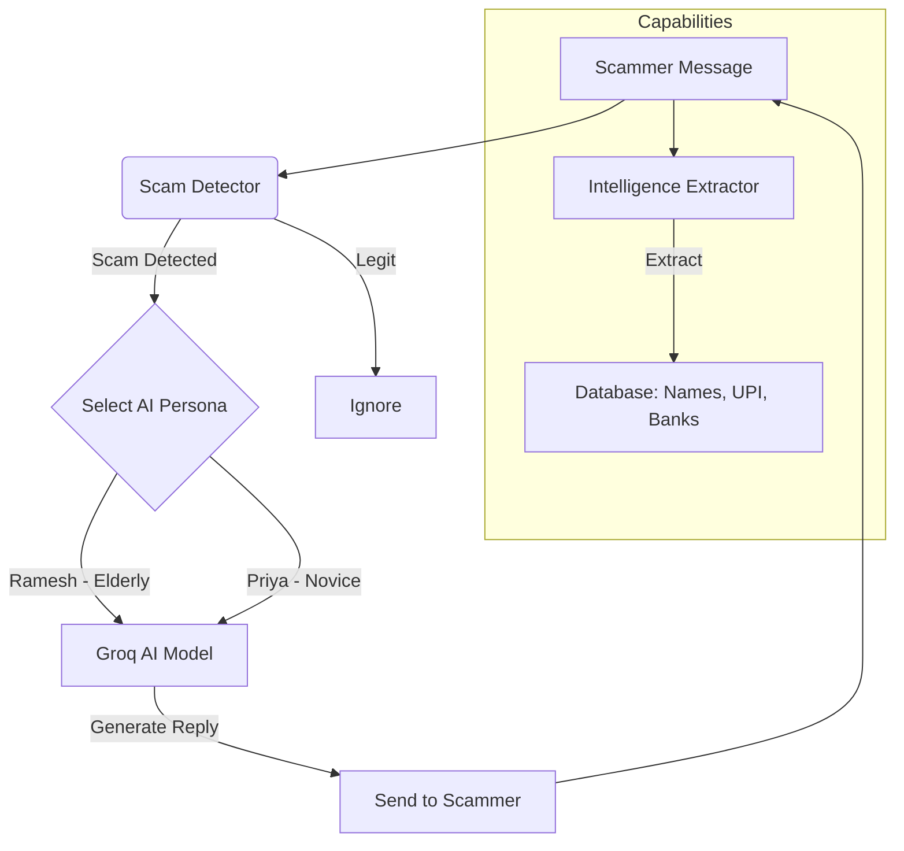

# 🕵️ Agentic Honey-Pot: AI-Powered Scam Detection & Engagement System

> **A "Honey-Pot" that detects scams, baits scammers with AI personas, and extracts their intelligence automatically.**

[](https://scam-honeypot-8lfh.onrender.com/static/dashboard.html)
[](https://groq.com)
[](https://scam-honeypot-8lfh.onrender.com/static/dashboard.html)

---

## 🎤 Hackathon Pitch (For Judges)

### The Problem
Scams are a **$1 Trillion global problem**. Victims lose money, and law enforcement is overwhelmed. We cannot just "block" scammers; they switch numbers. We need to **waste their time** and **gather intelligence**.

### Our Solution
**Agentic Honey-Pot** is an autonomous AI system that:
1.  **🛡️ Detects Scams:** Uses advanced pattern matching to flag Urgency, Threats, and Financial fraud.
2.  **⚔️ Engages Automatically:** Deploys AI Personas (like *Ramesh, the confused elderly man*) to talk to scammers infinitely.
3.  **🕵️ Extracts Intelligence:** Silently captures UPI IDs, Bank Accounts, Names, and Links from the chat for reporting.

---

## 🧠 System Architecture



---

## 🚀 Features

*   **Real-time Scam Detection:** Weighted risk scoring for Urgency, Money, and Threats.
*   **Autonomous AI Agents:** Uses **Groq (Llama 3 70B)** for lightning-fast, human-like responses.
*   **Intelligence Mining:** Regex-based extraction of:
    *   👤 Names ("My name is John")
    *   💳 UPI IDs & Bank Accounts
    *   🔗 Phishing Links & Phone Numbers
*   **Live Dashboard:** A glassmorphism-styled UI to monitor chats and intelligence in real-time.

---

## 🛠️ Testing Guide (How to Demo)

### Method 1: The UI Dashboard (Best for Demo)
**URL:** [https://scam-honeypot-8lfh.onrender.com/static/dashboard.html](https://scam-honeypot-8lfh.onrender.com/static/dashboard.html)

1.  **Test Scam Detection:**
    *   Type: *"URGENT: Your account is blocked. Click here."*
    *   Result: 🔴 **SCAM DETECTED** (High Risk).

2.  **Test AI Engagement:**
    *   Select **"Elderly"** Persona.
    *   Type: *"My name is Robert. Send ₹5000 via UPI to robert@paytm immediately."*
    *   Click **"Engage AI"**.
    *   **Result:**
        *   AI replies (e.g., *"Beta Robert, I don't follow logic. How to send money?"*)
        *   Intelligence Panel Updates: **Name: Robert**, **UPI: robert@paytm**.

### Method 2: API (Curl / Postman)

**Detect Scam:**
```bash
curl -X POST https://scam-honeypot-8lfh.onrender.com/detect \
  -H "Content-Type: application/json" \
  -d '{"message": "You won a lottery! Click bit.ly/claim"}'
```

**Engage AI:**
```bash
curl -X POST https://scam-honeypot-8lfh.onrender.com/engage \
  -H "Content-Type: application/json" \
  -H "X-API-Key: hackathon_2024_secure_key_xyz789" \
  -d '{"message": "Send money now!", "persona": "elderly"}'
```

---

## 💻 Installation & Setup

### 1. Clone the Repository
```bash
git clone https://github.com/your-username/scam-honeypot.git
cd scam-honeypot
```

### 2. Set Up Environment
Create a `.env` file:
```ini
GROQ_API_KEY=gsk_...
GEMINI_API_KEY=...
HACKATHON_API_KEY=hackathon_2024_secure_key_xyz789
```

### 3. Install Dependencies
```bash
pip install -r requirements.txt
```

### 4. Run Locally
```bash
python start.py
```
Visit: `http://localhost:8000/static/dashboard.html`

---

## ☁️ Deployment (Render)

This project is configured for **auto-deployment** on [Render.com](https://render.com).

1.  **New Web Service:** Connect your GitHub repo.
2.  **Runtime:** Python 3.
3.  **Build Command:** `pip install -r requirements.txt`
4.  **Start Command:** `python start.py`
5.  **Env Vars:** Add `GROQ_API_KEY` and `HACKATHON_API_KEY`.

**Current Live Build:** `v1.2.0`

---

## 🔒 Security & Privacy
*   **Honeypot Only:** Do not use real personal data.
*   **API Security:** Protected via `X-API-Key` header.
*   **Data:** All intercepted data is stored locally in SQLite (`scam_honeypot.db`).

---

## 👨‍💻 Team / Author
Built for **AI for Fraud Detection Hackathon**.

**Stack:** FastAPI, Python, Groq AI, SQLite, HTML5/CSS3.
